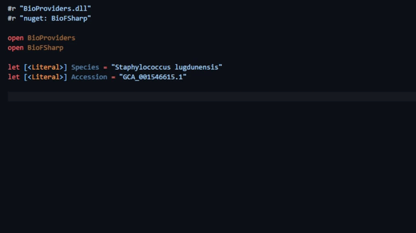

BioProviders: Simplifying Access to Bioinformatic Datasets
================================

The BioProviders package provides tools and functionality to simplify accessing and manipulating bioinformatic data.
The [.NET Bio](https://github.com/dotnetbio/bio) and [BioFSharp](https://github.com/CSBiology/BioFSharp) libraries
are used to parse and format the data provided by this package.

BioProviders is available through [NuGet](https://nuget.org/packages/BioProviders). 

## Type Providers

    

        

        

            
        

        

    

BioProviders implements Type Providers for accessing bioinformatic datasets. These Type Providers allow remote access
to data sources (e.g., GenBank) and type-safe representations of their data (e.g., GenBank Flat File).

* [GenBank Type Provider](library/GenBankProvider.html) - access to GenBank data using the `GenBankProvider<..>` type.
* [RefSeq Type Provider](library/RefSeqProvider.html) - access to RefSeq data using the `RefSeqProvider<..>` type.

## Contributing and Copyright

The project is hosted on [GitHub](https://github.com/AlexKenna/BioProviders) where you can 
[report issues](https://github.com/AlexKenna/BioProviders/issues), fork the project and submit pull requests.

The library is available under the OSI-approved MIT license. For more information see the 
[License file](https://github.com/AlexKenna/BioProviders/blob/main/LICENSE.md) in the GitHub repository.